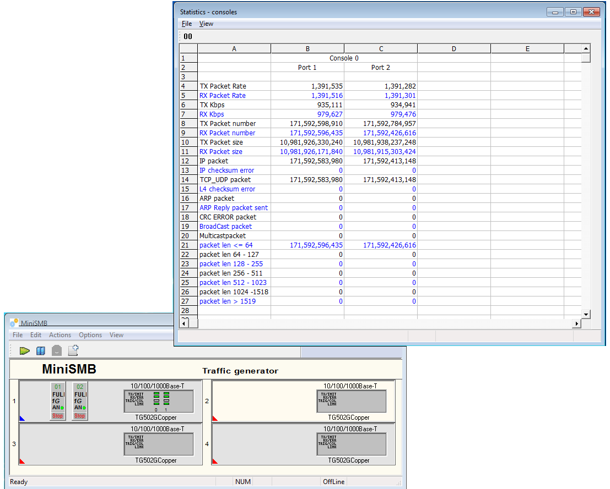

### Introduction

MiniSMB is a TCP/IP packet crafting and traffic generator tool. compare to commercial tool like Ixia IxLoad, Spirent  TestCenter, MiniSMB packet generator engine is able to running either on commodity x86-64 PC or a dedicate hardware solution and in terms of functionality it supports most of useful features like send rate in pps / bps, burst send mode, visualized packet editing through easy to use GUI. the performance MiniSMB could up to 14Mpps on intel 10G nic card.



### Who needs MiniSMB?
if you are currently debugging your network system,  testing your network stability, MiniSMB would be one of your best friend to crafting packet, generating packets through an easy to use GUI.

### Documentation
If you want to learn how to use MiniSMB IP traffic generator , please visit the [User Manual & Best Practice](http://docs.minismb.com).

### the useful tech resources
please checkout our Youtube channel for teaching video

### How to Install
MiniSMB-Win64 is a windows kernel level IP packet generator. the advantage of it running in kernel is that it completely bypass the windows network stack and injects the user packets into device driver directly with minimal overhead. so the performance of minismb IP pacet generator would be the best class. 

### Free edition vs Paid User
```
+-------------+-----------+-------------------------------------------+
|             | Free      |  Professional                             |
+-------------+-----------+-------------------------------------------+
| 1Gbps Link  |  100Kpps  |  no limit / $0.5 USD / per port, per day  |
+-------------+-----------+-------------------------------------------+
| 10Gbps Link |  1Mpps    |  no limit / $2 USD / per port, per day    |
+-------------+-----------+---------------------+---------------------+
```
* free / Promotion only support upto two packet generator interfaces

### Contact
If you have any questions, please send email to tony.cai@minismb.com
